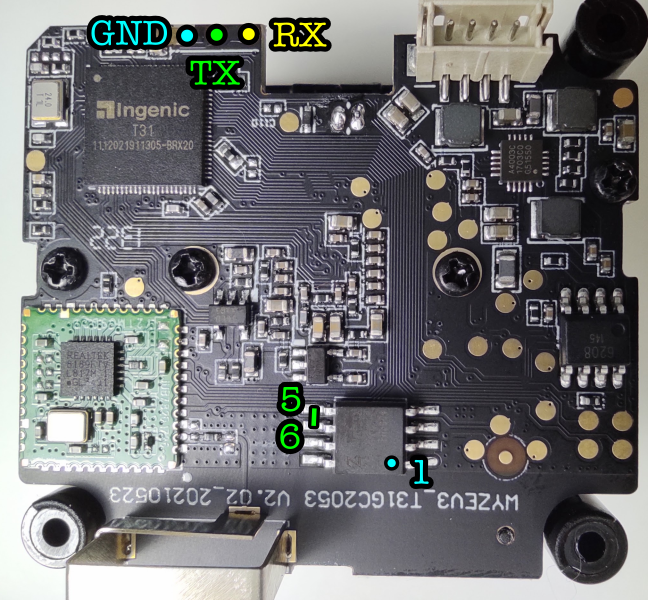

Installing OpenIPC on Wyze Cam V3
---------------------------------


### Connect the camera to UART adapter.

Connect an UART adapter to the camera according to the scheme below.
Remember that UART is a cross-connection so you connect `RX` contact on the
camera to `TX` on the adapter and vice-versa. `GND` connects to another `GND`.

With a metal tweezer or a small screwdriver short pins 5 and 6 of
the flash memory chip immediately after powering up the camera.
Keep them short until you see the bootloader shell prompt (2-3 seconds).




### Create a backup of the stock firmware.

Insert an empty SD cart into the card slot of the camera.

```
mmc dev 0
mmc erase 0x10 0x8000
mw.b 0x80600000 ff 0x1000000
sf probe 0
sf read 0x80600000 0x0 0x1000000
mmc write 0x80600000 0x10 0x8000
```

Remove the card from the camera and insert into your Linux computer.
Run the following command in terminal to copy raw data from the SD card
into a binary file on the computer:

```
dd bs=512 skip=16 count=32768 if=/dev/sdc of=./fulldump.bin
```

Make sure your resulting file is 16MB in size. Check integrity of the data
by unpacking the binary file with `binwalk`:

```
binwalk -e fulldump.bin
```


### Flash OpenIPC to the camera.

Create an installation SD card with the latest OpenIPC firmware binary file
by running `sdcards/sdcard1.sh` script.

Insert the card into the camera and run:

```
setenv baseaddr 0x80600000
setenv flashsize 0x1000000
mw.b ${baseaddr} 0xff ${flashsize}
fatload mmc 0:1 ${baseaddr} openipc-t31?-lite-8mb.bin
sf probe 0
sf erase 0x0 ${flashsize}
sf write ${baseaddr} 0x0 ${flashsize}
reset
```

After the camera reboots you should see the OpenIPC logo and a login prompt.
Log in as "root" with password "12345".


### Install wireless driver and initial configuration.

Create a configuration SD card by running `sdcards/sdcard2.sh` script.
You will be asked for SSID and password of your wireless network.

Insert the card into the camera and run:

```
firstboot
```

After camera reboots with the card in it, log in again and run:

```
/mnt/mmcblk0p1/install.sh
```

After the script finished its work, remove the card as prompted and reboot
the camera by powering it off, including the UART connection which also can
backfeed the module, and powering it up back after about five seconds.

At this moment, you should have a working camera connected to your wireless
network. Check the IP address issued to the camera by your local DHCP server
and open Web UI at port 85 to continue with configuration.

